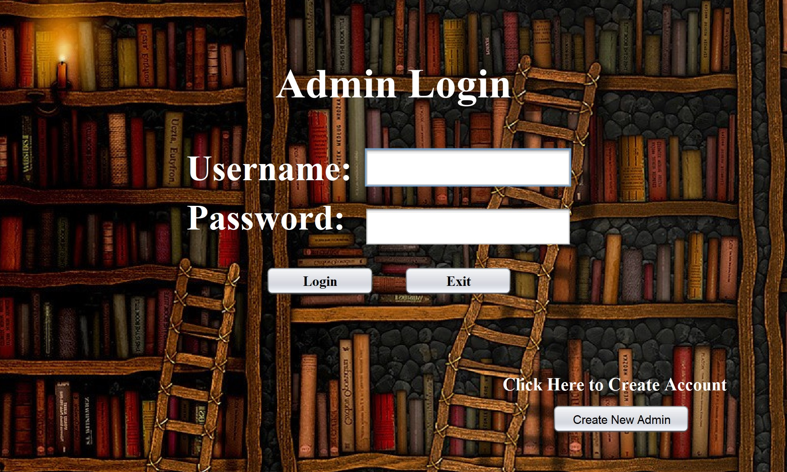
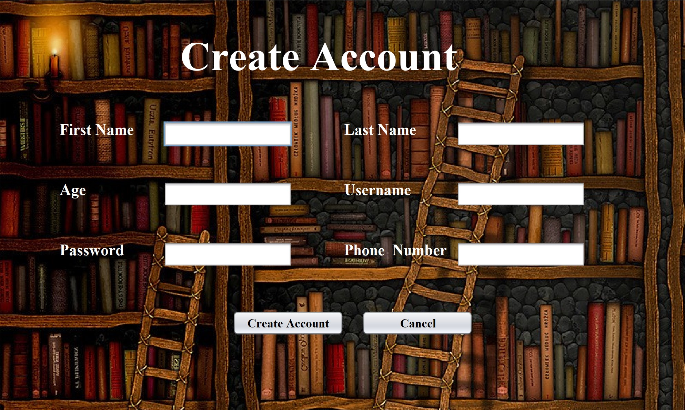

# Library-Catalog

### Technologies:

- Java
- JavaFX

## Table of Contents

- [About](#about)
- [Implementation](#implementation)
- [Application Running](#application-running)
- [Author Info](#author-info)

## About

> An application that stores active users, librarians, and books in a library database. The librarians can issue books to users and track user activity and the books they have checked out. The Users and Librarians can access the same database through different portals. While the users have the possibility of viewing all the books in the databaase, only Librarians can add books to the database or issue them out to students. 

## Implementation

Techniques Used:
- File Input/Output
- Serialization
- Try & catch / Exception Handling
- Arrays
- Loops
- Selection Sort
- Polymorphism
- Graphical User Interface
- Linear Search
- Linked List
- ArrayLists
- Selection Statements (if-else)
- Validating user inputs (abnormal input handling)

Netbeans and JavaFX was used to create the graphical user interface.

## Application Running

#### The Librarians have a seperate terminal from users that they login in through.

---

#### If a Librarian or User do not have existing accounts, they do have the option to make one. The Librarian and User share the same "Acount Creation" page and input the same information. However, the creation page accessed through the Librarian terminal adds a new Librarian account to the database.

---

#### The Librarian has the ability to add books to the database by inputting the corresponding attributes of a respective book.

---

## Author Info

* LinkedIn - [Ayub Shahab](https://www.linkedin.com/in/ayub-shahab-98b950202/)
