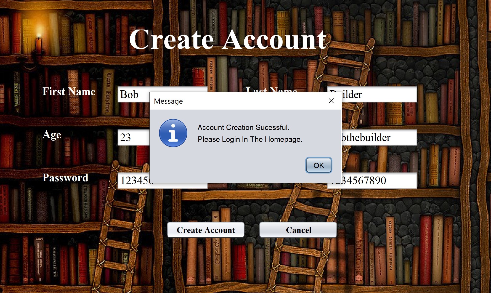
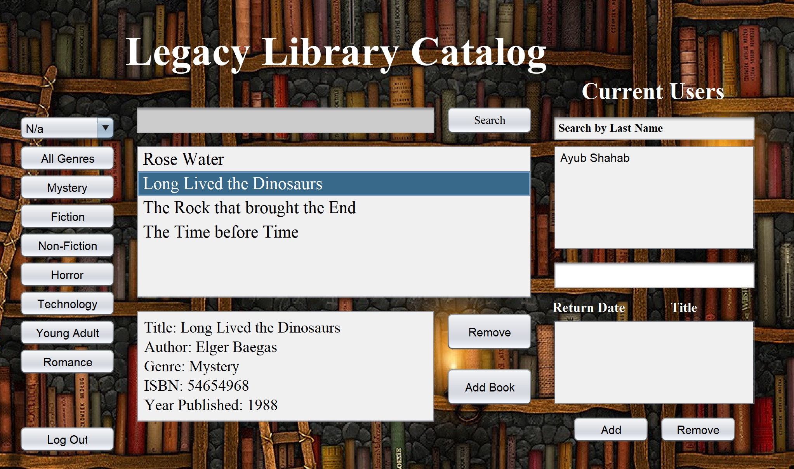
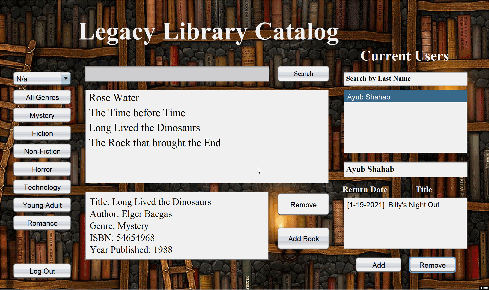
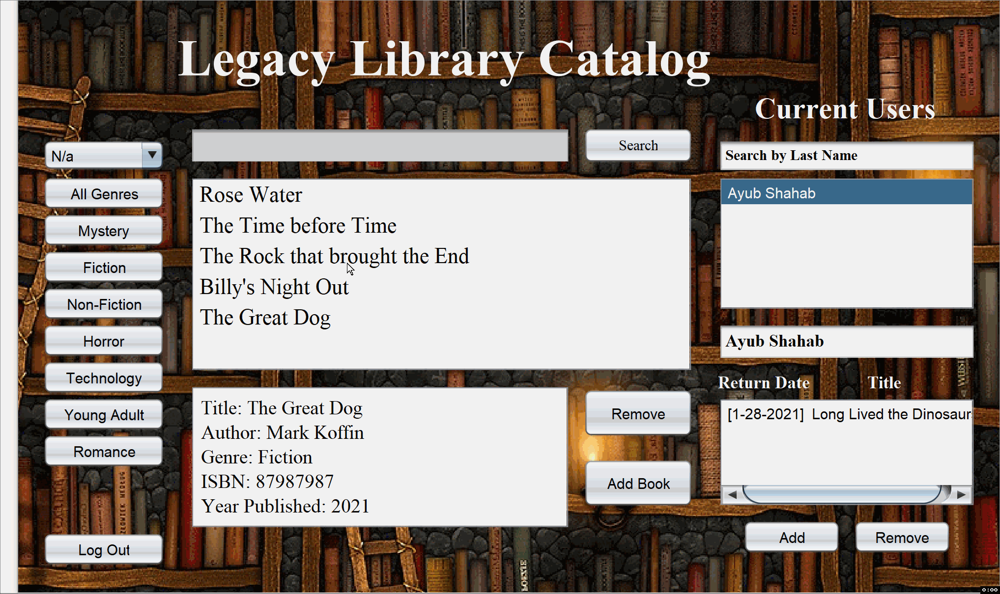
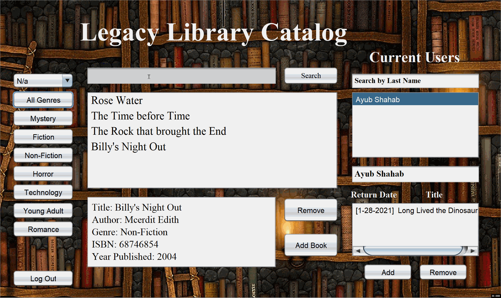
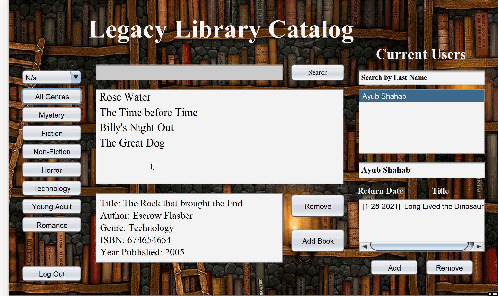
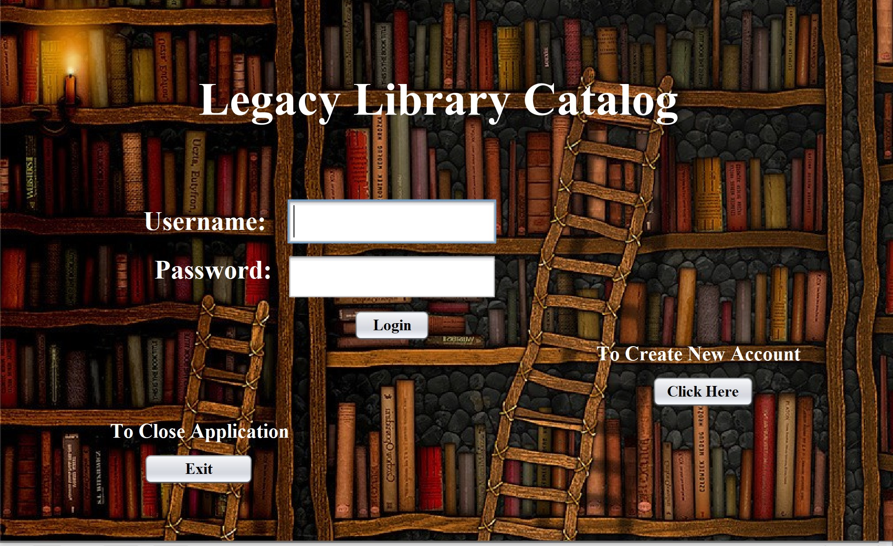
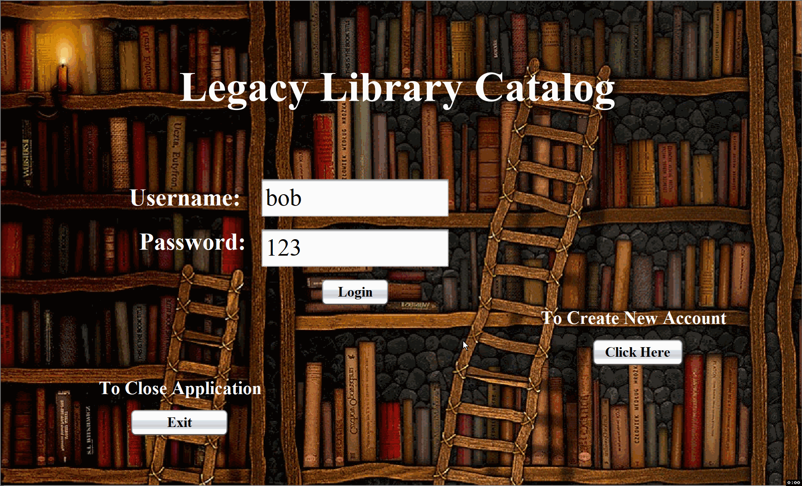
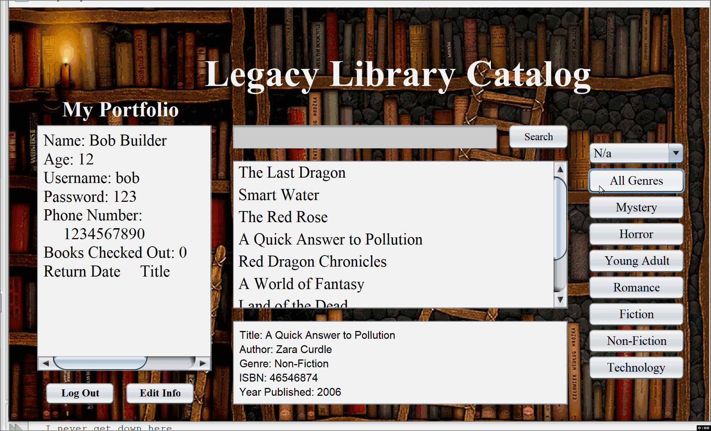
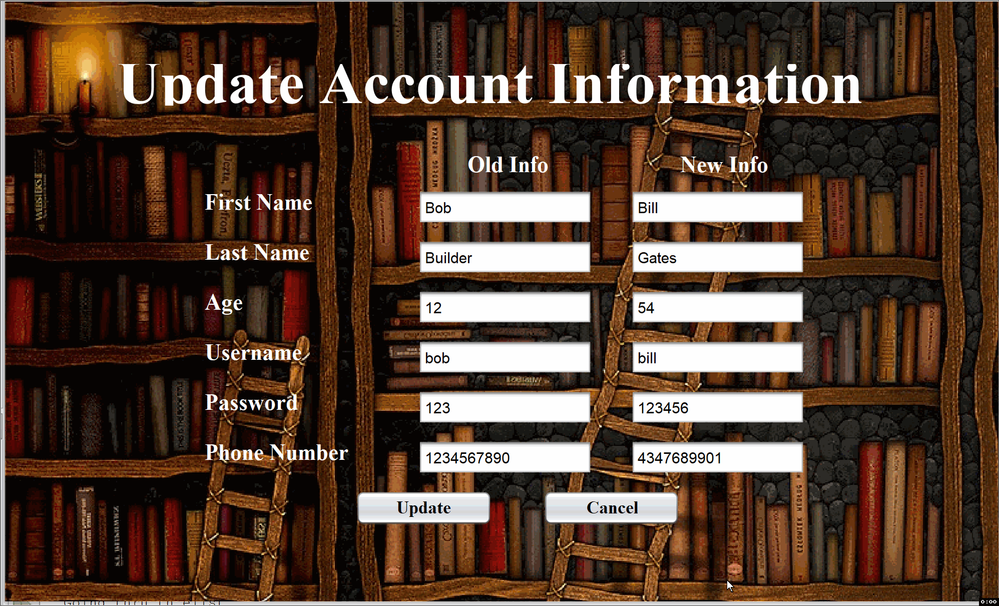

# Library-Catalog

### Technologies:

- Java
- JavaFX

## Table of Contents

- [About](#about)
- [Implementation](#implementation)
- [Application Running](#application-running)
- [Author Info](#author-info)

## About

> An application that stores active users, librarians, and books in a library database. The librarians can issue books to users and track user activity and the books they have checked out. The Users and Librarians can access the same database through different portals. While the users have the possibility of viewing all the books in the databaase, only Librarians can add books to the database or issue them out to students. 

## Implementation

Techniques Used:
- File Input/Output
- Serialization
- Try & catch / Exception Handling
- Arrays
- Loops
- Selection Sort
- Polymorphism
- Graphical User Interface
- Linear Search
- Linked List
- ArrayLists
- Selection Statements (if-else)
- Validating user inputs (abnormal input handling)

Netbeans and JavaFX was used to create the graphical user interface.

## Application Running

#### The Librarians have a seperate terminal from users that they login in through.

---

#### If a Librarian or User do not have existing accounts, they do have the option to make one. The Librarian and User share the same "Acount Creation" page and input the same information. However, the creation page accessed through the Librarian terminal adds a new Librarian account to the database.

---

#### If the input data is valid, then an account for the respective individual is made. The following shows account creation for a user, however the process would be the same for a Librarian.

---

#### After loggin in with the correct username and password, the Librarian goes to the following Homepage which lists all the books and users in the database.

---

#### The Librarian has the ability to check out books to users as well as add them back to the database once the book is returned and the due date has passed.

---

#### The Librarian has the ability to add books to the database by inputting the corresponding attributes of a respective book.

---

#### The Librarian also has the ability to remove books from the database by selecting the respective book and delisting it.

---

#### The Librarian has a search bar that he can use to search for books in the database.

---

#### The Librarian has the option to sort through books based on the genre.

---

#### The Librarian can also sort the various books in the databse by their Title, Author's Last Name, or ISBN number.

---

#### The user login terminal is seperate from the Librarian and is visualized in the following image.

---

#### When the user enters the correct username and password, he goes to the following user homepage.

---

#### Aside from adding or removing books from the library, the user also has the same abilities as the Librarian. The user can click through all the different books in the database as well as group them by their respective genres. The user also has the ability to sort the books by Title, Author's Last Name, or the ISBN number.

---

#### If the user desires to update his personal info, then he can do so by inputting the up to date info in their respective fields. 

---

## Author Info

* LinkedIn - [Ayub Shahab](https://www.linkedin.com/in/ayub-shahab-98b950202/)
